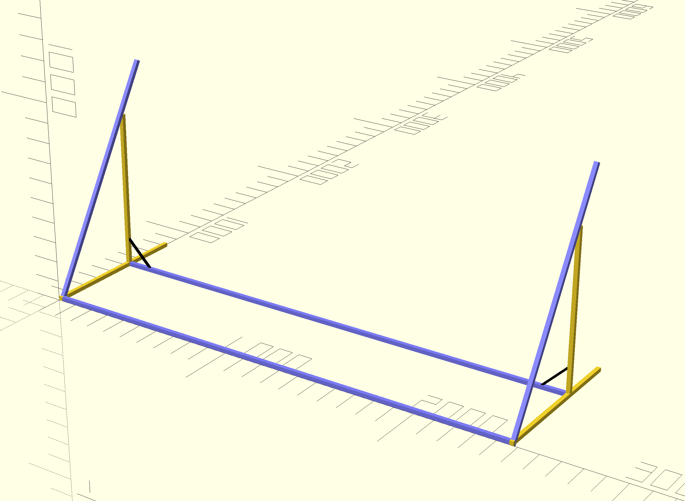

# Flexible Solar Panel Mount

Traditionally people suggest to use rigid solar panels because of their longevity, efficiency, and price.
But with the recent development of the flexible solar panels, they could have similar efficiency as their rigid counterpart, while being even cheaper.
This makes flexible solar panels an attractive option because they are much more lightweight and portable than the rigid ones.
However, the lifespan of flexible panels is indeed shorter, and it's largely because the way the panels are usually mounted prevents natural air convection, which makes the panel extremely hot.
This significantly reduces the efficiency and lifespan of the panel.
Therefore, if we mount the panels in a way that air could be freely circulated, chances are we can still get decent service life.
Unfortunately I didn't find any existing mounting brackets, commercial or DIY, for flexible panels, no matter whether they allow air circulation.
So I had to design one by myself, and open source it here hoping it helps someone sharing similar mind with me.
Note this design uses MIT license, and is provided as is, without warranty of any kind.
So use the design at your own risk.
And it's usually a good idea to consult your local government for any applicable permits and/or inspections.

## Materials

Each mount can accommodate four 100W flexible panels.
I used Dokio because of 1) the price; 2) the measured wattage is even higher than the spec.
But feel free to use any other brands.
You just need to adjust the dimensions accordingly.

Number x material | Link | Comment
--- | --- | ---
8 x 1.22m (48”) 2020 Aluminum Extrusion | https://a.co/d/aOKOHXg | Silver is better considering the rack will be under the sun for long time.  Note Amazon has 10 extrusions in one pack. So we only need one pack. Don’t buy 8 packs. That will be 80 extrusions! Same note for all the items below.
4 x 0.8m 2020 Aluminum Extrusion | https://a.co/3Xst4Ek | Same as above.
8 x corner connector | https://a.co/d/dT4oa4a | 
2 x printed enhancing bar | Print file can be found in [SolarHingeAndBar.scad](SolarHingeAndBar.scad) and [SolarHinge_BarShortM5.stl](SolarHinge_BarShortM5.stl), Amazon link https://a.co/d/9eJf0Ua | 3D printed. To provide extra (important) support and stability. If have no access to 3D printers, could try the amazon link but I haven’t tested it.
4 x printed hinge connector | Print file can be found in [SolarHingeAndBar.scad](SolarHingeAndBar.scad) and [SolarHinge.stl](SolarHinge.stl), Amazon link https://a.co/d/1wH5p9L | 3D printed. To provide flexible angle adjustment. If have no access to 3D printers,  could also use the amazon link. 
28 x M5 screws | https://a.co/d/dMQdEZM | For fixing the enhancing bar to the extrusion, and fixing the hinges to the extrusion.
28 x M5 T nuts | https://a.co/d/22kLgFH | 
6 x straight  connector | https://a.co/d/gWVIvK4 | Connecting two 1.22m aluminum extrusions to one 2.44m.
Steel cable | https://a.co/d/aEkKXhd | A spool could be used in a lot of racks.
Steel cable cutter | https://a.co/d/2HCfmHA | Only need one to cut the steel cables
4x Dokio 100W solar panel | https://a.co/d/0DmmWQx, https://www.ebay.com/itm/265814543967 | The Amazon price was $300 when I bought the 400W panels. But it’s out of stock right now. We could also buy it from ebay with roughly the same price.

## Printing Instructions

Better to use strong materials such as PA-CF given these are structural (functional) components.
The hinge is directly printed.
There is no need to assemble anything.
Just need to break any possible connections within the hinge and it could be directly used.

## Assemble instructions

1. Connect three 1.22m (48”) extrusions together using two straight connectors for better strength. Do it three times so we have now three 2.44m (96”) bars. The 4x Dokio panels has about 2.3m in width if placed vertically (profile), so the length is roughly the same.
The following figures shows two connected 1.22m bars, whose color will be used for 1.22m extrusions.

2. Connect the two 2.44m bars and two 0.8m bars as the figure shows using four corner connectors. This will act as the base of the panel rack. The following figure omits the connectors. Yellow bars are 0.8m.

3. Put another two 0.8m bars on the two far sides of the base vertically.

4. Mount the two enhancing bars to the location shown in the figure using M5 screws and T Nuts.

5. Mount two 1.22m extrusions to the locations shown in the figure using the 3D printed hinge. Note you may want to put the hinge to the back of the vertical bar to form a 150 degree angle instead of a 30 degree angle for easy mounting.

6. Mount the final 2.44m bar to the middle of the two bars mounted last step, as shown in the figure.

7. Then you can use the M5 screws and T Nuts to fix the upper edge of the solar panels to the horizontal bar mounted last step, using the mounting holes of the panels.
8. Then you can use the steel cable to go through all the lower mounting holes of the panels, and give them tension so the panels can be lifted to an angle. To fix the cable in place around the extrusion, just roll it around the bar for a few rounds. There is no need to tie a tie. It will lock itself.

The assembled mount with solar panels should look like this:

